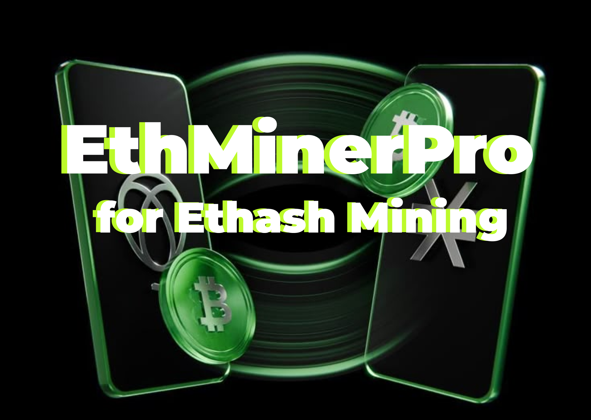

# ✨EthMinerPro✨ - The Powerhouse for Ethash Mining! 🚀

EthMinerPro is a meticulously engineered, open-source miner designed to unleash the full potential of your hardware for Ethereum (ETH) mining using the industry-standard Ethash algorithm. 🔥 Renowned for its speed, stability, and cutting-edge optimizations, EthMinerPro delivers unparalleled performance on both CPUs and GPUs! 💎

  <!-- Add your logo here.  Remove this line if you don't want a logo. -->

## ✨ Features

🌟 Key Features That'll Maximize Your ETH Rewards: 🌟

*   🎯 Ethash Algorithm Mastery: EthMinerPro is exclusively dedicated to the Ethash algorithm, guaranteeing maximum efficiency and profitability for Ethereum mining. 🏆
*   💪 Unleash CPU & GPU Prowess: Experience optimized mining paths for both modern CPUs and AMD/NVIDIA GPUs, pushing your hardware to its limits! 💻 ➡️ ⛏️
*   💰 Energy-Efficient Mining: Engineered for optimal power consumption 💡, boosting your profitability while minimizing your environmental impact. 🌎
*   🚀 Instant Setup: Our user-friendly command-line interface allows you to start mining in seconds! Just configure and go! 💨
*   🛡️ Robust Pool Management: Connect to multiple mining pools for increased reliability and failover protection. 🤝 Never miss out on potential earnings!
*   🧠 Intelligent Hardware Profiling: EthMinerPro intelligently detects your hardware 🕵️ and automatically optimizes configurations for peak performance. 💯
*   🪨 Unwavering Stability: Extensively tested for continuous, trouble-free operation. ⏱️ Say goodbye to crashes and downtime!
*   📜 Open Source and Transparent: Verified security and trust with our fully open codebase. 👀 Community contributions are highly encouraged! 🫂
*   🔄 Continuous Innovation: A dedicated team committed to delivering regular updates with the latest performance improvements and algorithm refinements! 🚀

## ⬇️ Installation

⛏️ Start Mining ETH in 4 Simple Steps: ⛏️

1.  Download the latest release from "releases/EthMinerPro.zip" ⬇️
2.  Extract the archive to your desired directory. 📁
3.  Execute the miner ethminerpro or ethminerpro.exe (depending on your operating system). 💻
4.  Edit the config.ini file with your pool and wallet details. 📝

## ⚙️ Configuration

🔧 Configuration Parameters (in config.ini): 🔧

*   algorithm: "ethash"
*   pool_url: "stratum+tcp://eth.pool.example.com:8008"
*   wallet_address: "YourEthereumWalletAddress"
*   worker_name: "MyRigName" (optional)
*   devices:  "gpu:0,1;cpu:all" (Specify which GPUs/CPUs to use)
*   api_port: 8000 (optional, for monitoring API)

---

⚠️ Disclaimer: EthMinerPro is provided as-is, without any warranty. Mining cryptocurrencies involves financial risk.  Use at your own risk.  The developers are not responsible for any losses incurred. Please comply with all applicable laws and regulations.

---

*Inspired by open-source mining software such as XMRig. Thank you to the open-source community!*
